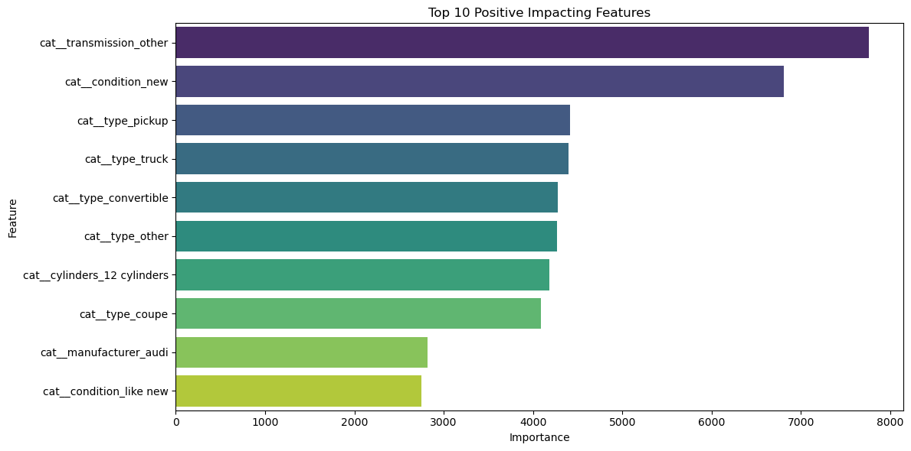
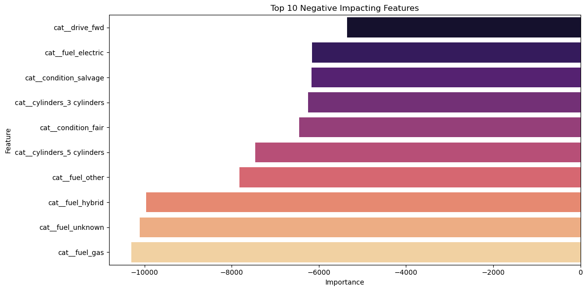

# 🚗 Used Car Price Prediction Analysis

## 🗎 Overview

In this project, I analyze a dataset containing information about 426,880 used cars from Kaggle. The original dataset contained 3 million records, but it was downsampled to 426,880 entries for faster processing and modeling. My goal is to understand what factors contribute to the price of used cars and provide actionable insights to a used car dealership about what consumers value in a used car.

In this project I follow the CRISP-DM (Cross-Industry Standard Process for Data Mining) methodology, which is a well-established framework for addressing data problems.

## 🗃️ Project Organization

* `notebook/used_cars.ipynb` The Jupyter notebook containing the data cleaning, analysis, and modeling steps.
* `data/vehicles.csv` The raw dataset used for the analysis.
* `images/` Folder containing the relevant plots and visualizations used in the analysis.

## 📊 Data

The dataset used for this project contains the following features:

* Price: The price of the used car.
* Year: The year of manufacture of the car.
* Manufacturer: The brand or manufacturer of the car.
* Model: The model name of the car.
* Condition: The condition of the car (e.g., excellent, good, like new).
* Fuel: The type of fuel used by the car (e.g., gas, diesel, electric).
* Transmission: The type of transmission (e.g., automatic, manual).
* Odometer: The distance driven by the car in miles.
* Drive: The drive type (e.g., 4wd, fwd, rwd).
* Size: The size category of the car (e.g., compact, full-size).
* Type: The type of vehicle (e.g., sedan, SUV, pickup).
* Paint color: The color of the car’s paint.
* State: The state in which the car is located.

The dataset can be found in `data/vehicles.csv`

## ✨ Data Preprocessing

The following steps were taken to clean and prepare the data:

1. Handling Missing Values
    * Rows with missing values in critical columns (e.g., `year`, `price`, `odometer`) were removed.
    * Categorical Columns: For categorical columns, missing values were filled with `unknown`.
    * After preprocessing, no missing values remained in the dataset.
2. Removing Irrelevant Columns
    * Columns such as `id`, `VIN`, and `region` were dripped from the dataset, the first two because they were irrelevant to the research and the latter because it overlapped with State.
3. Converting Data Types
    * The year column was converted to integer type.
4. Handling Categorical Variables
    * For columns like `manufacturer`, `model`, `size`, `type`, and `paint_color`, categories with less than 1% frequency were grouped into an `other` category to reduce dimensionality.
5. Removing outliers
    * Extreme outliers in the `price` column were removed by keeping only valies between the 1st and 99th percentiles.
6. Feature Engineering:
    * A new feature, `age`, was created by subtracting the `year` column from the current year (`2024`).
7. Preprocessing for Modeling
    * Numeric features (`age`, `odometer`) were standardized using `StandardScaler`.
    * Categorical features were one-hot encoded using `OneHotEncoder`
8. Data Splitting
    * The data was split into training and testing sets (80% train, 20% test) for model training and evaluation.

## 🔍 Key Findings

### Model Performance

1. Model Performance: Three regression models were tested:
    * Linear Regression
        * R² Score: 0.45682
        * RMSE: $9,898.68
    * Ridge Regression
        * R² Score: 0.45682
        * RMSE: $9,898.69
    * Lasso Regression
        * R² Score: 0.45666
        * RMSE: $9,900.17
    * All three models showed similar performance, `Ridge Regression` was chosen for further optimization using `GridSearchCV`.
2. Optimal model parameters
    * To find the best features and hyperparameter `alpha`. leading to the following optimal parameter: **Best Alpha (Ridge)**: `0.1`

## 💸 Recommendations to Dealership

The top features positively impacting used car pricing include vehicle condition (especially "new" or "like new"), certain car types like trucks, pickups, and convertibles, larger engine sizes (e.g., 12 cylinders), and premium brands like Audi. On the other hand, features negatively affecting pricing include front-wheel drive (FWD) vehicles, less conventional fuel types like electric, hybrid, and unknown, as well as cars in "salvage" or "fair" condition and those with smaller engines (e.g., 3 or 5 cylinders). For the dealership, this suggests a focus on high-demand car types, well-maintained vehicles in excellent condition, and premium brands. Additionally, balancing the inventory with fuel-efficient and high-performance models, while avoiding overstocking cars with lower drive types or subpar conditions, can help optimize sales and pricing.

## 🔮 Next Steps & Recommendations

For the used car dealership, the following actions are recommended:

* Prioritize Vehicles with Positive Features: Cars that are in good or excellent condition, have automatic transmission, and are pickups or trucks are likely to fetch higher prices.
* Assess the Market for Negative Features: Cars with salvage titles, non-gasoline fuel types (e.g., electric, hybrid), or front-wheel drive (fwd) may need to be priced more competitively or avoided for premium sales.
* Continual Model Improvement: Further feature engineering (e.g., adding more information about the car’s maintenance history) and testing different models could improve prediction accuracy.

For further research, the following actions are recommended:

* Apply `GridSearchCV` to other regression models and fine tune hyperparameters.
* Explore using the complete dataset (millions) of records, and see how that changes the data skewness and results. 
